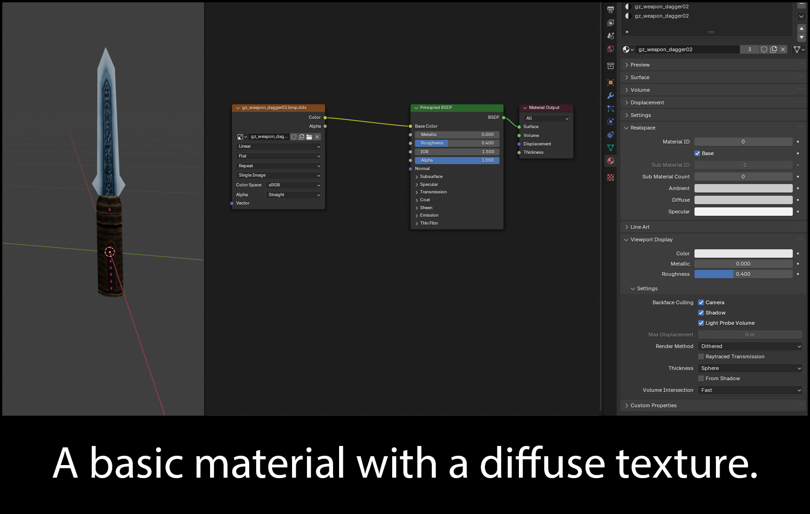
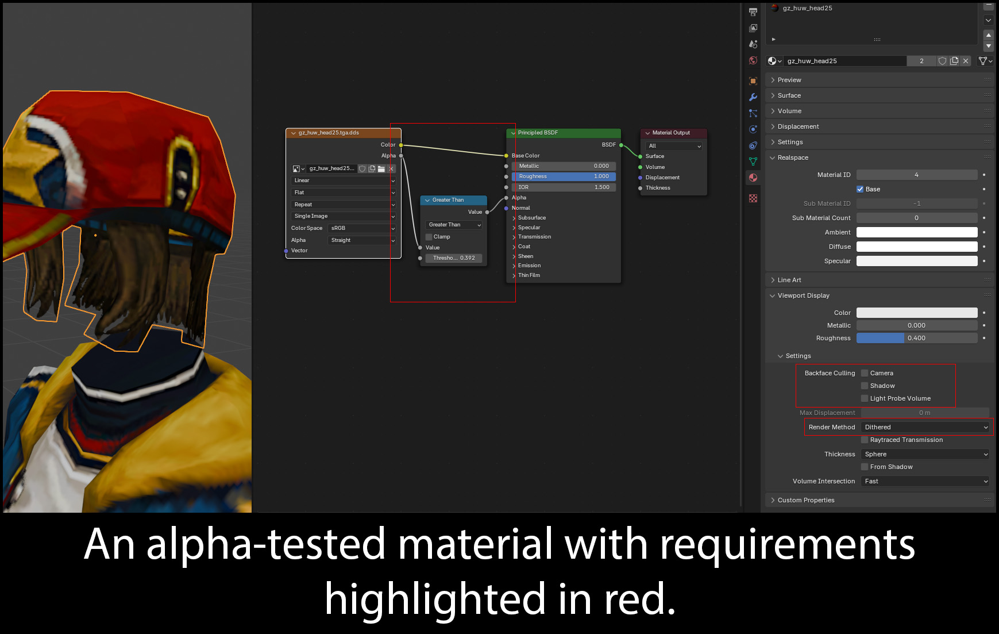
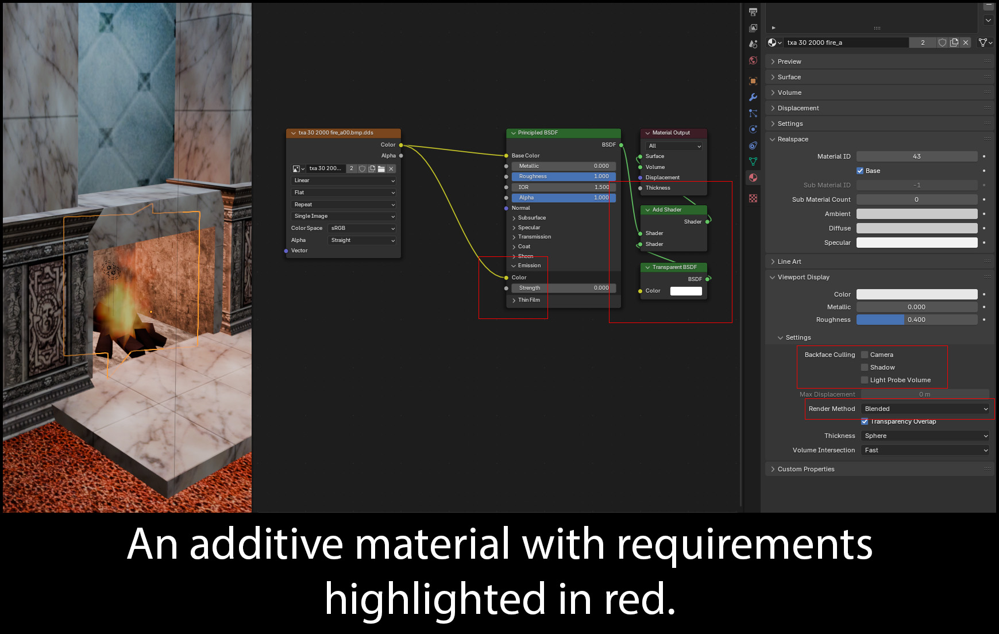

# ***io_scene_gzrs2***

GunZ: The Duel RealSpace2/3 content importer for Blender 4.2.x LTS. 
Intended for users wishing to visualize and modify GunZ content or prepare the data for a modern game engine.

Please report bugs and unimplemented features to: ***Krunk#6051***

RaGEZONE thread: ***https://forum.ragezone.com/f496/io_scene_gzrs2-blender-3-1-map-1204327/***

## ***Make sure you specify a working directory in addon preferences.​***
***Don't update Blender's major version. This plugin will only support the v4.2 branch until further notice.***

# Latest Update

[***ONLY WORKS WITH BLENDER 4.2.x!! >> DOWNLOAD v0.9.5***](https://github.com/Krunklehorn/io-scene-gzrs2/releases/tag/v0.9.5)

* NEW: .ani import support for GunZ 1 versions: 0x0012, 0x1001, 0x1002 and 0x1003
  * Animations become Actions, manage them with the Timeline or Dopesheet areas, combine them using NLA tracks
  * Bone type: Animates the selected armature's bones, disconnects bones to allow translation, controls bone position and rotation, but not scale
  * TM type: Similar to Bone, but generates it's own armature, controls object position, rotation and scale
  * Vertex type: Adds absolute mode shape keys, animates by keying Evaluation Time, may fail for meshes with duplicate or overlapping vertices
* NEW: Material guidelines for .elu export have been added, see below!
* Mesh nodes beginning with "Dummy" are now treated as bones

# Current Import Features

* supported filetypes: .rs, .elu, .ani, .col, .lm, .scene.xml, .prop.xml, .cl2
* displays world geometry, occlusion planes and collision data using mesh objects
* displays BSP bounding boxes, sounds, spawns, powerups and other dummies using empties
* approximates fog using a volume scatter or volume absorption shader
* groups lights with similar properties, re-interprets the data to be useful in Blender
* displays lightmaps using a linked node group for quick toggling
* creates a driver object for quickly tuning lights and fog

# Current Export Features

## Model Export (.elu)

* GunZ 1 version 0x5007
* supports both static and skinned meshes
* automatically triangulates quads

<!-- -->

* exports smooth normals if custom split normals are included
* exports bone weight data from vertex groups
* exports UV data from UV channel 0
* exports cloth physics data from color attribute channel 0

<!-- -->

* requires valid materials in each slot, if present (see below)
* requires bones be contained in an Armature object
* requires Armatures be linked using an Armature modifier (not parented!)
* requires vertex groups corresponding to bones by exact name (case-sensitive!)
* requires unique names for all bones across all linked armatures

## Required Material Nodes

### Standard Materials

| Type | Socket Configuration |
| :---: | :---: |
| Material Output | BSDF -> Surface |
| Principled BSDF | BSDF -> Surface |

### Additive Materials

| Type | Socket Configuration |
| :---: | :---: |
| Principled BSDF | BSDF -> Shader (1) |
| Transparent BSDF | BSDF -> Shader (2) |
| Add Shader | Shader -> Surface |

### Optional Nodes

| Type | Default | Label (right click -> rename) | Details |
| :---: | :---: | :---: | :---: |
| Image Texture | N/A | If labeled, represents a path relative to GunZ.exe | Color -> PBSDF Base Color |
| Math (Greater Than) | 0 || Required for alpha-testing, parameter 2 controls the cutoff, must link Image Texture Alpha -> Math Value (1) -> PBSDF Alpha |

### Render Method

| Style | Render Method | Details | Socket Configuration |
| :---: | :---: | :---: | :---: |
| Alpha Blending | Dithered || Image Texture Alpha -> PBSDF Alpha |
| Alpha Testing | Dithered || Image Texture Alpha -> Math Node (Greater Than) -> PBSDF Alpha |
| Additive | Blended || Image Texture Color -> PBSDF Emission |

### Extra Parameters (Material Properties -> Realspace)

| Name | Type | Default | Details |
| :---: | :---: | :---: | :---: |
| Base | Bool | True | Base-materials can have sub-materials, which may be required for certain effects  |
| Sub Material ID | Integer | -1 | Only valid for sub-materials |
| Sub Material Count | Integer | 0 | Only valid for base-materials |
| Ambient | Color | 0.588235, 0.588235, 0.588235 ||
| Diffuse | Color | 0.588235, 0.588235, 0.588235 ||
| Specular | Color | 0.9, 0.9, 0.9 ||

### Extra Parameters (Material Properties -> Viewport Display -> Settings)

| Control | Details |
| :---: | :---: |
| Two-sided | Controlled by the Backface Culling checkboxes (keep all three in sync) |
| Specular Power | Controlled by the the Principled BSDF Roughness value, lower is smoother & glossier |

### Material ID/Sub-ID Guidelines

Realspace materials are not well defined. Certain effects are implicit, some cancel each other out, some behave differently based on context. Frankly, it's a mess.

The following guidelines help you set your material IDs and sub-IDs to sane values during export...

1. Material IDs must not have gaps. Example: cannot export with IDs 0, 3, and 4. Instead, use 0, 1, and 2.
2. Different meshes can use the same material, but one mesh with different materials must mark them as sub-materials by unchecking Base.
3. The sub-IDs of sub-materials must match the material slot they are used in. The top slot is 0.
4. Groups of sub-materials need a base of the same ID.*
5. The sub-material count of a base material must be high enough to hold it's sub-materials.

*No. 4 is handled for you automatically. Future updates will handle more.

These guidelines are based on patterns found in the vanilla GunZ content. Please submit an issue if you belive these guidelines are too restrictive or in error.

The Maiet Character Viewer (MCV) can be used to change these after exporting if you need to do something more advanced.

### Notes on texture paths, labels and valid data subdirectories...

RealSpace2's .elu format references textures using relative file paths. Paths are either relative to the .elu or relative to GunZ.exe.

Blender on the other hand, references textures using absolute file paths. Paths are always relative to your system's root. (ex: C:/...)

If you get this error during export...

    Unable to determine data path for texture in ELU material!

...this means one of your Image Texture node labels does not contain a valid RealSpace2 data subdirectory.
This check is not case sensitive. Valid data subdirectories are...

    GunZ 1/.mrs: 'Interface', 'Maps', 'Model', 'Quest', 'Sfx', 'Shader', 'Sound' and 'System'
    GunZ 2/.mrf: 'Data', 'EngineRes'

To work around this difference, you can control what path is written during export by labeling an Image Texture node. (right click -> rename)
- If an Image Texture node has no label, the file name of the image is written, which RealSpace2 interprets as .elu relative
- If it does have a label, the label needs to be a file path relative to Gunz.exe

The plugin will automatically truncate and verify the result for you. It will also remove double extensions (tex.bmp.dds -> tex.bmp) and sanitize double dds errors. (tex.dds.dds -> tex.dds)

### Examples of valid path labels:
- "model\woman\shoes.tga"
- "Documents\My Custom Gunz Content\SFX\fireball.bmp.dds"

### Examples of invalid path labels:
- "shoes.tga" -> just omit the label entirely
- "Documents\My Custom Gunz Content\fireball.bmp.dds" -> rearrange your folders, include a data subdirectory

## Lightmap Export (.lm)

* overwrite only
* supports image data as well as UVs
  * requires a GunZ 1 .rs file for the same map in the same directory
  * UV export requires an active mesh object with valid UVs in channel 3
* includes experimental "version 4" for bugfixes and DXT1 support (thanks to DeffJay)
  * version 4 lightmaps take less space and load faster, resolutions up to 8k are now viable
  * for private servers only, v4 lightmaps do not work with vanilla GunZ
  * contact Krunk#6051 for information on how to implement this

# Planned Features

* GunZ 1: alpha .elu versions: 0x11, 0x5001, 0x5002 and 0x5003
* GunZ 1: .ani support
* GunZ 1: .nav support

<!-- -->

* GunZ 2: .env.xml support
* GunZ 2: embedded scene hierarchies (ex: props with attached lights)
* GunZ 2: texture composition layers (terrain)

# Known Issues

* GunZ 1: most community maps load fine but quest maps have not been tested at all yet
* GunZ 1: handful of .elus with improper bone weights (woman-parts_eola)
* GunZ 1: all polygons in UV channel 2 come out garbled (import the lightmap and use channel 3 for now)
* GunZ 1: some polygons in UV channel 3 come out garbled on maps with multiple lightmaps (Citadel)
* GunZ 1: some elus with reversed winding-order/flipped normals (woman-parts27, woman-parts_sum08, woman-parts_santa, etc.)
* GunZ 1: some .elu map materials with incorrect flags that should be overridden by their .rs.xml counterparts

<!-- -->

* GunZ 2: some objects are not oriented correctly (spotlights)
* GunZ 2: embedded scene hierarchies are not parsed yet (lighting_candlestick_y02, lighting_chandelier_g01, etc.)
* GunZ 2: materials do not support composition layers yet (weird colored terrain)

# Screenshots

# Special Thanks

[three-gunz](https://github.com/LostMyCode/three-gunz) 
[open-gunz](https://github.com/open-gunz/ogz-source) 
[rahulshekhawat](https://github.com/rahulshekhawat/blender-elu-ani-importer) 
[x1nixmzeng, ThePhailure772, Lotus & coyotez1n](https://github.com/x1nixmzeng/z3ResEx) 
[Nayr438](https://github.com/Nayr438) 
[DeffJay](https://github.com/Jetman823) 
[HeroBanana](https://github.com/HeroBanana) 
bastardgoose 
Menotso 
Ennui