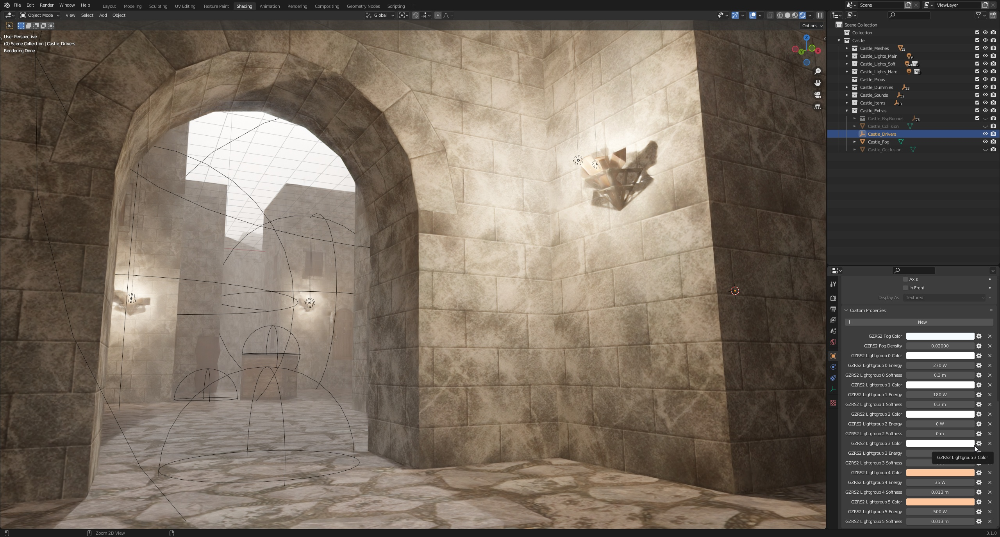

# ***io_scene_gzrs2***

GunZ: The Duel RealSpace2.0 map import for Blender 3.1 or higher.  
Intended for users wishing to visualize maps and prepare the data for a modern game engine.

Please report bugs and unimplemented features to: ***Krunk#6051***

RaGEZONE thread: ***https://forum.ragezone.com/f496/io_scene_gzrs2-blender-3-1-map-1204327/***

[***DOWNLOAD v0.8.1***](https://github.com/Krunklehorn/io-scene-gzrs2/releases/download/v0.8.1/io_scene_gzrs2_v0.8.1.zip)

# Recent Updates

* Fixed silent fail when attempting to hide BspBounds collection
* Fixed double dds extension causing issues parsing some texture paths

# Current Features

* displays world geometry, occlusion planes and collision data using meshes
* displays BSP bounding boxes, sounds, spawns, powerups and other dummies using the appropriate empties
* preserves n-gons and custom mesh normals
* groups lights with similar properties, re-interprets the data to be useful in Blender
* includes a driver object for quickly tuning lights and fog
* notifies the user of..
  * missing textures and empty texture paths
  * out-of-bounds and unused material slots
  * objects with no corresponding dummy
  * unimplemented xml tags (please report these)

# Planned Features

* .elu/.ani model import
* option to re-center all geometry
* nav mesh support

# Known Issues

* quest maps and community maps have not been tested at all yet
* some alpha textures have white halos in render mode (Town)
* collision mesh and occlusion planes appear black in render mode (just disable them for now)
* some maps don't have a corresponding dummy for each object (is this information stored elsewhere?)
* textures are only searched for in the surrounding map folders, there may be other locations but I don't know yet

# Special Thanks

[minidom](https://github.com/python/cpython/blob/3.10/Lib/xml/dom/minidom.py)  
[three-gunz](https://github.com/LostMyCode/three-gunz)  
[open-gunz](https://github.com/open-gunz/ogz-source)  
