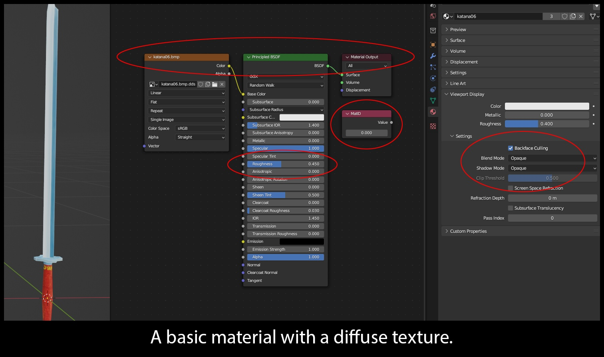
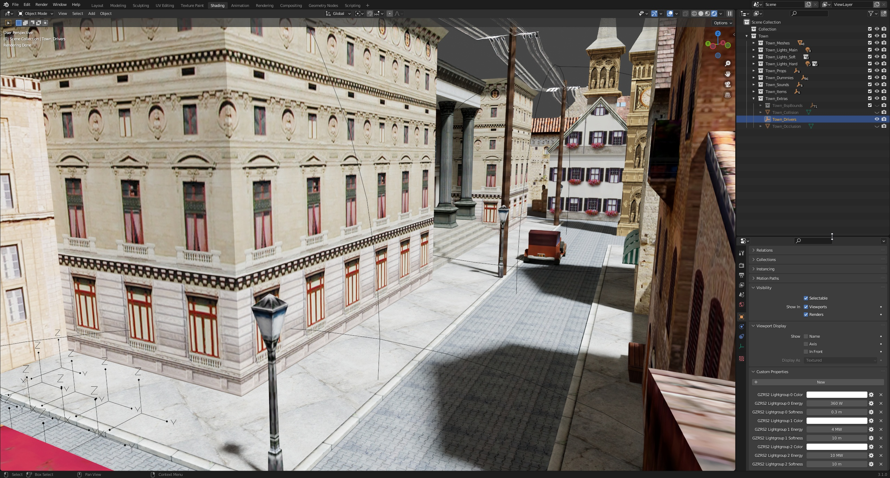
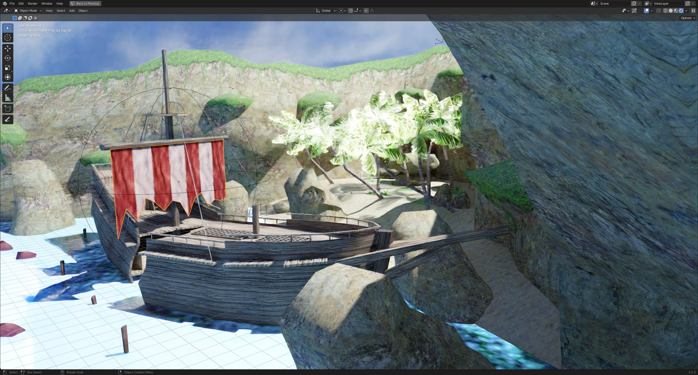
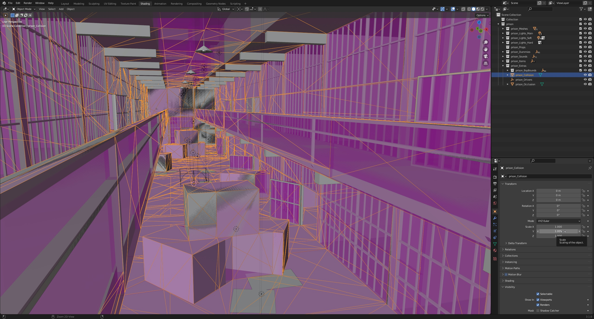

# ***io_scene_gzrs2***

GunZ: The Duel RealSpace2/3 content importer for Blender 4.1 and up.
Intended for users wishing to visualize and modify GunZ content or prepare the data for a modern game engine.

Please report bugs and unimplemented features to: ***Krunk#6051***

RaGEZONE thread: ***https://forum.ragezone.com/f496/io_scene_gzrs2-blender-3-1-map-1204327/***

# Latest Update

[***DOWNLOAD v0.9.3 -- UPDATE YOUR BLENDER TO 4.1 FIRST!!***](https://github.com/Krunklehorn/io-scene-gzrs2/releases/download/v0.9.3/io_scene_gzrs2_v0.9.3.zip)

* NEW: Blender 4.1 support!
* NEW: GunZ 2 retail .elu import support! 0x5012, 0x5013 and 0x5014
  * Not guaranteed to work with RaiderZ content
* Fixed a hang when loading some .elus without logging enabled
* Fixed return handling for .elu versions < 0x500D
* Split upward directory search limits
* Other minor bug fixes

# Current Import Features

* supported filetypes: .rs, .elu, .col, .lm, .scene.xml, .prop.xml, .cl2
* displays world geometry, occlusion planes and collision data using mesh objects
* displays BSP bounding boxes, sounds, spawns, powerups and other dummies using empties
* approximates fog using a volume scatter or volume absorption shader
* groups lights with similar properties, re-interprets the data to be useful in Blender
* displays lightmaps using a linked node group for quick toggling
* creates a driver object for quickly tuning lights and fog
* notifies the user of..
  * missing textures and empty texture paths during import
	* invalid texture paths during export (see below)
  * out-of-bounds and unused material slots
  * unimplemented xml tags

# Current Export Features

### Model Export (.elu)

* GunZ 1 version 0x5007
* supports both static and skinned meshes
* automatically triangulates quads

<!-- -->

* exports smooth normals if custom split normals are included and auto-smooth is enabled
* exports bone weight data from vertex groups
* exports UV data from UV channel 0
* exports cloth physics data from color attribute channel 0

<!-- -->

* requires valid materials in each slot, if present (see below)
* requires bones be contained in an Armature object
* requires Armatures be linked using an Armature modifier (not parented!)
* requires vertex groups corresponding to bones by exact name (case-sensitive!)
* requires unique names for all bones across all linked armatures

#### Required Material Nodes

| Type | Label (right click -> rename) | Socket Configuration |
| :---: | :---: | :---: |
| Material Output || BSDF -> Surface |
| Principled BSDF || BSDF -> Surface |
| Value | matID ||

#### Optional Nodes

| Type | Default | Label (right click -> rename) | Details |
| :---: | :---: | :---: | :---: |
| Image Texture | N/A | If labeled, represents a path relative to GunZ.exe | If included, Color -> PBSDF Base Color is required |
| Value | 0 | subMatID | May be required for certain effects |
| Value | 0 | subMatCount | May be required for certain effects |
| RGB | 0.588, 0.588, 0.588 | ambient ||
| RGB | 0.588, 0.588, 0.588 | diffuse ||
| RGB | 0.9, 0.9, 0.9 | specular ||

#### Transparency Settings

| Style | Blend Mode | Details | Socket Configuration |
| :---: | :---: | :---: | :---: |
| Alpha Blending | Alpha Hashed || Image Texture Alpha -> PBSDF Alpha |
| Alpha Testing | Alpha Clip || Image Texture Alpha -> PBSDF Alpha |
| Additive | Alpha Blend || Image Texture Color -> PBSDF Emission |

#### Extra Controls

| Control | Details |
| :---: | :---: |
| Two-sided | Controlled by the Backface Culling checkbox |
| Specular Smoothness | Controlled by the the Principled BSDF Roughness value, lower is smoother |

#### Notes on texture paths, labels and valid data subdirectories...

RealSpace2's .elu format references textures using relative file paths. Paths are either relative to the .elu or relative to GunZ.exe.

Blender on the other hand, references textures using absolute file paths. Paths are always relative to your system's root. (ex: C:/...)

If you get this error during export...

    Unable to determine data path for texture in ELU material!

...this means one of your Image Texture node labels does not contain a valid RealSpace2 data subdirectory.
Valid data subdirectories are...

    'Interface', 'Maps', 'Model', 'Quest', 'Sfx', 'Shader', 'Sound' or 'System'

This check is not case sensitive.

To work around this, we control what path is written during export by labeling an Image Texture node. (right click -> rename)
- If an Image Texture node has no label, the file name of the image is written, which RealSpace2 interprets as .elu relative.
- If it does have a label, the file path needs to be relative to Gunz.exe.

The plugin will automatically truncate and verify the result for you. It will also remove the second extension if multiple are present. (ex: tex.bmp.dds -> tex.bmp)

#### Examples of valid node labels:
- "model\woman\shoes.tga"
- "Documents\My Custom Gunz Content\SFX\fireball.bmp.dds"

#### Examples of invalid node labels:
- "shoes.tga" -> just omit the label entirely
- "Documents\My Custom Gunz Content\shoes.bmp.dds" -> rearrange your folders, include a data subdirectory

### Lightmap Export (.lm)

* overwrite only
* supports image data as well as UVs
  * requires a GunZ 1 .rs file for the same map in the same directory
  * UV export requires an active mesh object with valid UVs in channel 3
* includes experimental "version 4" for bugfixes and DXT1 support (thanks to DeffJay)
  * version 4 lightmaps take less space and load faster, resolutions up to 8k are now viable
  * for private servers only, v4 lightmaps do not work with vanilla GunZ
  * contact Krunk#6051 for information on how to implement this

# Planned Features

* GunZ 1.5 elu versions: 0x11 and 0x5001, 0x5002 & 0x5003
* .ani support
* nav mesh support

# Known Issues

* GunZ 1: most community maps load fine but quest maps have not been tested at all yet
* GunZ 1: handful of .elus with improper bone weights (woman-parts_eola)
* GunZ 1: all polygons in UV channel 2 come out garbled (import the lightmap and use channel 3 for now)
* GunZ 1: some polygons in UV channel 3 come out garbled on maps with multiple lightmaps (Citadel)
* GunZ 2: some objects are not oriented correctly (spotlights)
* GunZ 2: embedded scene hierarchies are not parsed yet (lighting_candlestick_y02, lighting_chandelier_g01, etc.)
* GunZ 2: materials do not support composition layers yet (weird colored terrain)

# Screenshots

# Special Thanks

[three-gunz](https://github.com/LostMyCode/three-gunz)
[open-gunz](https://github.com/open-gunz/ogz-source)
[rahulshekhawat](https://github.com/rahulshekhawat/blender-elu-ani-importer)
[x1nixmzeng](https://github.com/x1nixmzeng/z3ResEx)
[Nayr438](https://github.com/Nayr438)
[DeffJay](https://github.com/Jetman823)
