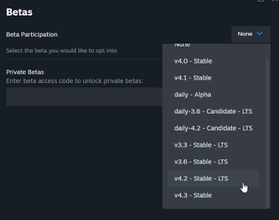
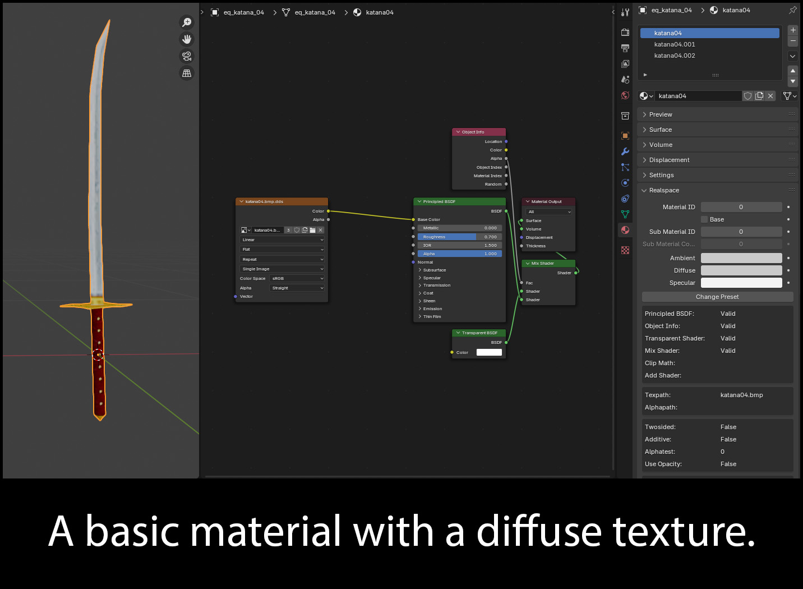

# ***io_scene_gzrs2***

GunZ: The Duel RealSpace2/3 content importer for Blender 4.2.x LTS. 
Intended for users wishing to visualize and modify GunZ content or prepare the data for a modern game engine.

Please report bugs and unimplemented features to: ***Krunk#6051***

RaGEZONE thread: ***https://forum.ragezone.com/f496/io_scene_gzrs2-blender-3-1-map-1204327/***

## ***Make sure you specify a working directory in addon preferences.​***
***Don't update Blender's major version. This plugin will only support the v4.2 branch until further notice.***

# Latest Update

[***ONLY WORKS WITH BLENDER 4.2.x!! >> DOWNLOAD v0.9.7***](https://github.com/Krunklehorn/io-scene-gzrs2/releases/tag/v0.9.7)

* NEW: .rs export, yes, that's full map export!
  * Currently in beta, works fine for small, boxy test maps
  * Check the GitHub page for requirements and known issues
* NEW: World lightmap selector and "Prepare for Bake" operator
  * Sets the active image texture node of all world materials
  * Sets the active UV channel of all world meshes
  * Disables the lightmap mix
  * Marks the selected image as a fake user
* Fixed .rs import 'Bake' mode
* .col import now reads both solid and hull collision geometry
* .col import can now read cut planes for debugging
* Other minor fixes

# Current Import Features

* Fully supported filetypes: .elu, .ani, .col, .cl2, .nav
* Mostly supported filetypes: .rs, .lm
* Partially supported filetypes: .scene.xml, .prop.xml

<!-- -->

* Displays world geometry, collision and navigation data using mesh objects
* Displays bsptree and octree bounding boxes, occlusion planes, sounds, spawns, powerups and other dummies using empties
* Approximates fog using a volume scatter or volume absorption shader
* Reinterprets light data to be useful in Blender
* Displays lightmaps using a linked node group for quick toggling

# Current Export Features

## Map Export (.rs) (Beta!)

* Writes .rs, .bsp, .col, .lm and .xml data all at once
* Exports empties, meshes, lights and cameras
* Requires at least one world mesh
* Requires at least one collision mesh or a world mesh marked with '+Collision'
  * Collision geometry should form a closed surface with no overlaps or holes
  * Collision geometry should should appear red when viewed from out of bounds through the 'Face Orientation' overlay
* Ignores anything not marked by the type system...
  * Empty: Spawn, Flare, Sound, Smoke, Item, Occlusion
  * Mesh: World, Collision, Navigation
  * Light: Static, Dynamic
  * Camera: Wait, Track

### Tips & Tricks

* Collision generation doesn't work well with dense, thin or curved geometry; don't stick a 300k polygon toothpick in an open room
  * Marking a world mesh as "Detail" prevents it from cutting nearby geometry during bsptree and octree generation, this should be used for telephone poles, statues, flags etc.
  * "Detail" does not affect collision tree generation, you must manually create separate, low-poly collision meshes for complex objects
  * Empties marked as "Occlusion" planes can be used to specify bsptree and octree cuts manually, similar to Radiant/Hammer "Hint" brushes, for advanced users

### Untested Features

* Spawn empties for quest mobs
* Occlusion planes for props
* Smoke empties
* Camera empties
* Flag props

### Known Issues

* FALLING THROUGH FLOOR: You must ensure collision meshes are completely sealed!
  * Collision geometry should form a closed surface with no overlaps or holes
  * Collision geometry should should appear red when viewed from out of bounds through the 'Face Orientation' overlay
  * Future updates *may* address this with leak detection, orientation checks and/or CSG union pre-processing
* PROPS WON'T SHOW UP: Prop (.elu) file names are written to .rs.xml under 'OBJECTLIST' however, the props themselves must be exported manually using a selection filter
* RE-EXPORT IS UNTESTED: Don't expect it to work without some effort, most vanilla maps require touch ups

## Your First Map

### Thinking Inside The Box

The plugin adds a custom type system for managing Realspace2 data. Look for the panel labeled "Realspace" in the World, Object, Object Properties and Material tabs to configure these properties.

The following instructions assume a basic knowledge of Blender.

1. Add a cube to the scene, scale it up a bit, then flip it (Alt + N) inside out.
2. Set the mesh type to "World" and enable "Collision".
3. Add a material then choose "Change Preset" and select "Colored"
    * If your geometry appears black, navigate to the world tab and run "Toggle Lightmap Mix" or try re-applying the preset.
4. Export and test.

### Thinking Outside The Box

Realspace's collision system requires a closed surface with no overlaps or holes.

World geometry can contribute to the collision pass, but for outdoor scenes or any map with a window, we usually have an open landscape that is largely inaccessible to the player. Calculating collision for all of that stuff would be wasteful.

Instead of managing two versions of our map, one visual and one physical, we can separate what pieces are exposed to the outside and turn them into collision geometry.

1. Select the ceiling and separate it (P) to it's own mesh.
2. Set this new mesh's type to "Collision" and delete all it's materials.
3. Back in the original mesh, select the edges of the opening and extrude them (E) higher, then seal (F) them, and separate (P) them to a new mesh.
5. Give the new mesh a new material with a different color. Keep it's type as "World" but disable "Collision".
4. Export and test.

*Pro Tip: Re-import the resulting .col file and look at the mesh labeled "_Solid". See how it cuts off beyond the fake ceiling? All that space up there can be filled with whatever you want now. The same can be done for windows, walkways and other openings. If you remove the external geometry but keep the opening sealed by collision, you can surround the map with a giant sky prop. This is the basic technique used by MAIET in all outdoor maps.*

### Configuring Entities

What most game engines refer to as 'entities', Realspace internally refers to as 'dummies'. In Blender, we represent them using 'empties' and will refer to them as such.

Things like spawn points, powerups and ambient sounds are configured using empties.

1. Add three empties to the scene.
2. Mark one as type "Spawn", one as "Item" and one as "Sound".
3. For the sound entity, change the "Filename" field to something like amb_shore_2d or amb_fireplace. Don't include any file extension.
4. For testing purposes, change the timer on the item entity to something low.
5. Move the entities wherever you please. The spawn entity's local y-axis points in the direction the player will face, while the sound entity may need it's size or shape adjusted.
6. Export and test.

*Gotcha: Powerups never spawn if your test client creates a fake match with no gametype.*

*Coming soon: A full description of all entity types. In the meantime, feel free to play around with their settings.*

### Configuring Materials

Each world mesh can only have one material. You must separate (P) and join (Ctrl + J) geometry to swap it's material.

During development it may be convenient to join all meshes into one. This is fine, just make sure they're separated by material before exporting.

1. Add a second, smaller box to the scene.
2. Assign a new material and change it's preset to "Textured".
3. Open the shader node editor and find the image texture node connected to the 'A' socket of the "Lightmap Mix" group.
4. Open your image to this node and take note of it's name and path.
    * If your geometry appears black, navigate to the world tab and run "Toggle Lightmap Mix" or try re-applying the preset.
5. Unwrap your geometry as you please. The first channel is for textures.
6. Copy your images to the output directory of your map.
    * Use the override controls in the Material->Realspace panel to specify a sub-directory if desired.
7. Export and test.

### Configuring Lights

Realspace uses the nearest dynamic light source to light player models at runtime. Realspace's light system is empirical, while Blender's is physically based.

To get around this, the plugin has a translation layer for approximating light data and keeping the result synchronized between both engines.

1. Add a light to the scene and set it's type to "Dynamic". Only point lights are supported at runtime.
2. Switch your viewport shading mode to "Display Render Preview".
    * If your geometry appears black, navigate to the world tab and run "Toggle Lightmap Mix" or try re-applying your presets.
3. Use the fly controls (Shift + ~) to move the view inside your map's boundary.
4. Set the light's color as you please.
5. Instead of modifying the light's power directly, use the "Recalculate Lights & Fog" button after tweaking the Realspace panel settings.
    * The values listed under "Render" are global. They affect all lights in the scene.
6. Keep the light's "Intensity" field at 1 and configure the "Attenuation End" field (measured in meters) until the light is bright enough.
7. Export and test. Notice that the world itself has no shading, only the player character is lit.

### Lightmap Baking: Preparation

Lights in Realspace don't affect world geometry. We have to bake a lightmap to give depth to the world.

1. Add a second UV channel to all your world meshes and unwrap them as you please.
    * Blender's default "Lightmap Pack" works fine but it disconnects all faces and is very wasteful.
    * Manually adding seams, unwrapping and packing a lightmap is guaranteed to add hair to your chest. This is an artform, treat it like one.
    * Beware 3rd party lightmap plugins that fuck with the shader node configuration.
2. Organize your project data into collections: one for meshes, one for empties, one for lights and one more labeled "Bake".
3. Duplicate ALL of your meshes, join them (Ctrl + J) into one and put the result in your "Bake" collection.
4. Toggle the "Disable In Renders" switch OFF on your source mesh collection.
5. Navigate to the Output->Output panel and set the following fields...
    * File Format: PNG
    * Color: RGB
    * Color Depth: 16
    * Color Management->Follow Scene
6. Navigate to the Render->Sampling->Render panel and set the following fields...
    * Noise Threshold: Disabled
    * Render Samples: 16
7. Navigate to the Render->Color Management panel and set the "View Transform" field to "Standard".
8. Navigate to the Render->Bake panel and set the following fields...
    * Bake Type: Diffuse
    * Direct: Enabled
    * Indirect: Enabled
    * Color: Disabled
    * Selected to Active: Disabled
    * Target: Image Textures
    * Clear Image: Enabled
    * Margin Type: Adjacent Faces
    * Margin Size: 128 or higher

### Lightmap Baking: Diffuse

1. Create a new image with no alpha channel. Give it square, power-of-two dimensions. 1024x1024 is fine.
2. Navigate to World->Realspace and assign the new image to the "Lightmap" field.
3. Navigate to the world tab. Run both "Recalculate Lights & Fog" and "Prepare for Bake".
    * If you make changes to the scene, always come back to recalculate and prepare before you start baking again.
4. Navigate to Render->Bake and make sure your bake mesh is selected. Hit that Bake button and wait.
    * On a good GPU, a 1024x1024 bake at 16 samples should finish within a few seconds.
    * If this simple bake is super slow, search the internet about enabling "GPU Compute" to verify your graphics card is being utilized.
5. Wait until the bake is finished, then navigate to the world tab and toggle "Lightmap Mix" to check the result.
    * If everything looks super bright, first try toggling "Lightmap Mod4" before tweaking any lights.
    * Keep sample count low for now, we denoise manually and you can always rebake later.
    * For a final bake, anything above 1024 samples is probably overkill.
6. Save your image to the same directory as your .blend project. This is NOT your lightmap yet, it's only the image data.

### Lightmap Baking: Denoise and Export

Blender's denoiser currently only applies to the 'Combined' pass, which includes the surface color.

Since we only want surface lighting, we have to denoise manually.

1. Open the compositor, enable "Use Nodes" and delete all the nodes inside.
2. Add a "Viewer" node and disable alpha.
3. Add an "Image" node and select your lightmap image.
4. Add a "Denoise" node and disable HDR.
5. Plug the image sockets between the nodes in this order: Image->Denoise->Viewer
6. Open the image editor and switch to the "Viewer" image.
7. Toggle the viewer node's alpha switch on and off to force it to update. (Oh, Blender)
8. Save the image and overwrite the lightmap you previously saved to disk.
    * Make sure it's a PNG set to RGB at 16 bits! Blender likes to switch back to 8 all the time it's fucking annoying.
9. Switch the image editor to your original, noisy lightmap and select "Image->Reload". Presto!
10. Delete your bake mesh or set it's type to "None".
11. Export and test.

### Bonus: Ambient Occlusion

The "Ambient Occlusion" bake type gives quick, decent results and doesn't require fiddling with lights.

Although unrealistic, it's always a nice touch. Advanced users should consider baking it using the "Emit" pass for extra control.

1. Create two new images, same settings as your diffuse lightmap. One for AO and another for mixing.
2. Link the AO lightmap in the world tab.
3. When baking, set the bake type to "Ambient Occlusion" and crank up the samples to 1024. AO is fast so we go nuts.
4. When compositing, add the AO to it's own image node and combine them with a "Mix" node set to "Soft Light".
5. Plug the diffuse lightmap into the top mix socket and the AO lightmap into the bottom one, then plug the mix output into the denoiser.
6. Save, overwrite and reload the viewer image into your mixing lightmap.
7. Link the mixing lightmap in the world tab.
8. Export and test.

*Pro Tip: Lightmap color is multiplicative, but lightmaps can do more than just shading. Try breaking up repetitious surfaces by adding dirt, rust, puddles or even graffiti. Mappers are encouraged to try their best and make GunZ beautiful. Who knows, maybe the community will host a contest sometime.*

## Model Export (.elu)

* GunZ 1 version 0x5007
* Supports both static and skinned meshes
* Automatically triangulates quads and ngons

<!-- -->

* Exports smooth normals if custom split normals are included
* Exports bone weight data from vertex groups
* Exports UV data from UV channel 0
* Exports cloth physics data from color attribute channel 0

<!-- -->

* Requires mesh objects be of type 'Prop'
* Requires empties be of type 'Attachment'
* Requires valid materials in each slot, if present (see below)
* Requires bones be contained in an Armature object
* Requires Armatures be linked using an Armature modifier (not parented!)
* Requires vertex groups corresponding to bones by exact name (case-sensitive!)
* Requires unique names for all bones across all linked armatures

### Material Parameters & Presets

Materials have changed! No more node wrangling, it's all handled by presets! =)

The plugin adds a custom "Realspace" panel in the Material Properties view. (see above) The panel provides a live report on what data will be written if exported. To modify the overall look of a material, use the "Change Preset" button.

Some parameters can be configured for special behavior:

| Parameter | Controlled By | Details |
| :---: | :---: | :---: |
| Texture / Alpha Path | Override Texpath / Write Directory ||
| Twosided | Material Properties -> Viewport Display -> Backface Culling ||
| Additive | Change Preset -> Additive ||
| Alphatest | Change Preset -> Tested | Configure the Threshold value of the Math: Greater Than node |
| Use Opacity | Change Preset -> Blended | Must have a valid texture in the Image Texture node |
| Is Animated | File name of the connected texture ||
| Frame Count / Frame Speed / Frame Gap | File name of the connected texture ||

## Navmesh Export (.nav)

* Automatically triangulates quads and ngons
  * For best results, user should do so manually
* Selected mesh must be manifold

## Lightmap Export (.lm)

* overwrite only
* supports image data as well as UVs
  * requires a GunZ 1 .rs file for the same map in the same directory
  * UV export requires an active mesh object with valid UVs in channel 2
* includes experimental "version 4" for bugfixes and DXT1 support (thanks to DeffJay)
  * version 4 lightmaps take less space and load faster, resolutions up to 8k are now viable
  * for private servers only, v4 lightmaps do not work with vanilla GunZ
  * contact Krunk#6051 for information on how to implement this

# Planned Features

* GunZ 1: alpha .elu versions: 0x11, 0x5001, 0x5002 and 0x5003
* GunZ 1: lightmap export UV generation

<!-- -->

* GunZ 2: .env.xml support
* GunZ 2: embedded scene hierarchies (ex: props with attached lights)
* GunZ 2: texture composition layers (terrain)

# Known Issues

* GunZ 1: handful of .elus with improper bone weights (woman-parts_eola)
* GunZ 1: some elus with reversed winding-order/flipped normals (woman-parts27, woman-parts_sum08, woman-parts_santa, etc.)
* GunZ 1: some maps with a ton of skipped dummies (Halloween Town)

<!-- -->

* GunZ 2: some objects are not oriented correctly (spotlights)
* GunZ 2: embedded scene hierarchies are not parsed yet (lighting_candlestick_y02, lighting_chandelier_g01, etc.)
* GunZ 2: materials do not support composition layers yet (weird colored terrain)

# Screenshots

# Special Thanks

[three-gunz](https://github.com/LostMyCode/three-gunz) 
[open-gunz](https://github.com/open-gunz/ogz-source) 
[rahulshekhawat](https://github.com/rahulshekhawat/blender-elu-ani-importer) 
[x1nixmzeng, ThePhailure772, Lotus & coyotez1n](https://github.com/x1nixmzeng/z3ResEx) 
[Nayr438](https://github.com/Nayr438) 
[DeffJay](https://github.com/Jetman823) 
[HeroBanana](https://github.com/HeroBanana) 
Ennui 
bastardgoose 
Menotso 
Milanor 
Sunrui 
Foxie 